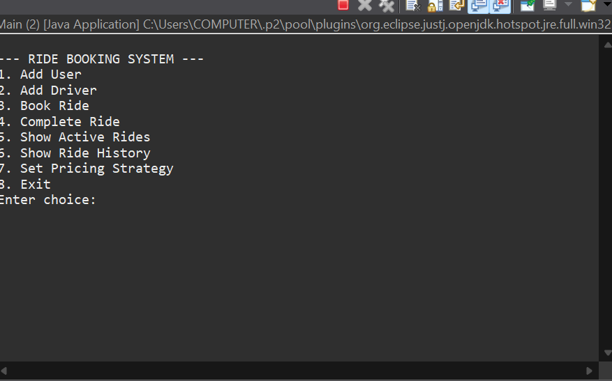

# 🚕 Ride Booking System (Mini Uber / Ola)

An object-oriented console-based Ride Booking System built using **Java**, demonstrating strong concepts of **OOP, DSA, and design patterns**.  
This project simulates booking rides, assigning nearest drivers, and applying different pricing strategies.

---

## ✨ Features

- User and Driver management
- Ride booking and completion
- Nearest driver selection using PriorityQueue
- Shortest route calculation using Graph (Dijkstra)
- Dynamic pricing using Strategy Pattern:
  - Standard Pricing
  - Surge Pricing
  - Discount Pricing
- Active ride tracking using HashMap
- Menu-driven console interface

---

## 🧠 Concepts Used

### Object-Oriented Programming
- Abstraction
- Inheritance
- Polymorphism
- Encapsulation
- Strategy Design Pattern

### Data Structures & Algorithms
- HashMap → Active rides tracking
- PriorityQueue → Nearest driver selection
- Graph → Shortest path (Dijkstra’s Algorithm)

---

## 🛠️ Technologies

- Java
- Eclipse IDE
- Console-based application

---

## ▶️ How to Run

1. Open the project in **Eclipse**
2. Locate the `Main` class
3. Right-click → **Run As → Java Application**
4. Follow the on-screen menu to book rides

---

## 📸 Sample Output

You can see a sample output of the application below:

---

## 🖼️ How to Add Output Image

1. Take a screenshot of the console output
2. Rename it to:
